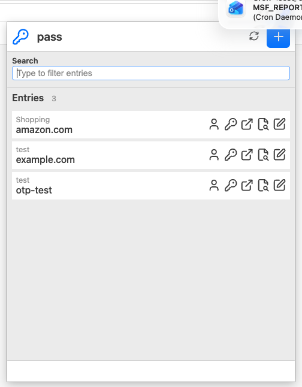
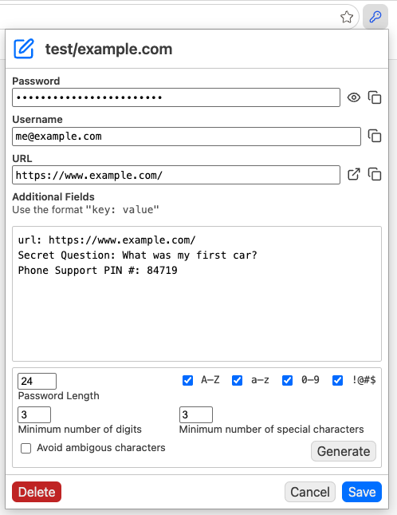
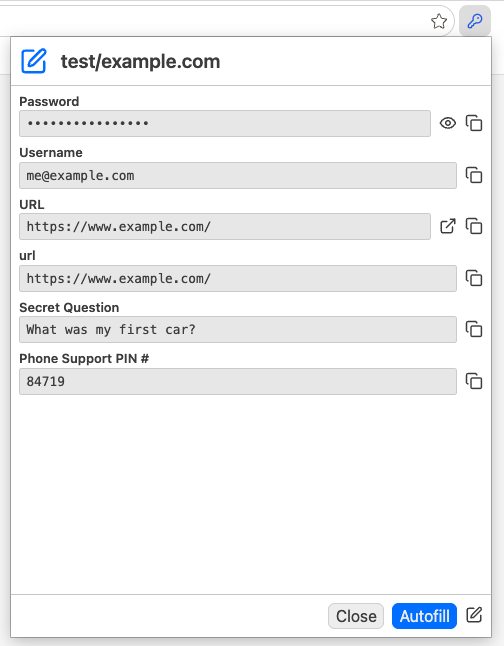
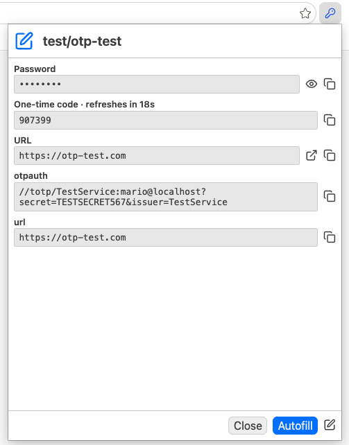
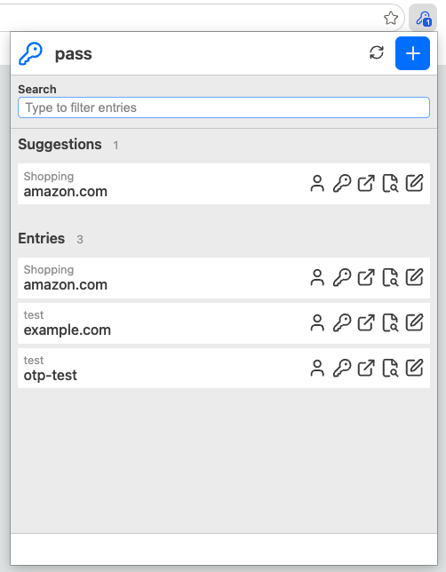

# pass-browser

A browser extension for Chrome, Edge, Chromium, and Firefox that integrates the [pass](https://www.passwordstore.org/) standard Unix password manager.


## Features

- Manage your pass password store from your browser
- Create / update / delete entries
- Auto-suggest passwords based on the current URL
- Support for TOTP/OTP codes (requires pass-otp)
- Integrated password generator
- Sync the store with git
- Secure architecture with native messaging
- Cross-platform: Linux, macOS, Windows (where pass is available)

## Screenshots


Password entries


Create/edit entry


Entry details


Entry details with OTP


Suggestions for the current URL

## Architecture

```
Browser Extension ←→ Native Messaging ←→ Python Host ←→ pass CLI
    (Sandboxed)         (JSON/stdio)      (Native)      (GPG)
```

The extension communicates with a native Python script that executes `pass` commands. This approach ensures:
- Security: Extension runs in browser sandbox
- Compatibility: Works with standard `pass` installation
- No network access required
- No telemetry or tracking

## Requirements

### All Platforms
- [pass](https://www.passwordstore.org/) password manager installed and configured
- Python 3.6 or later
- Chrome, Chromium, Edge, or Firefox browser

### Optional
- [pass-otp](https://github.com/tadfisher/pass-otp) for OTP/2FA support
- git (for syncing password store)


## Installation

### 1. Clone or Download this Repository

```bash
git clone https://github.com/yourusername/pass-browser.git
cd pass-browser
```

### 2. Install the Native Messaging Host

**macOS/Linux:**
```bash
cd native-host
./install.sh
```

**Windows:**
```batch
cd native-host
install.bat
```

This will:
- Install the Python host script to `~/.local/share/pass-browser/`
- Install the native messaging manifest for Chrome/Edge

### 3. Load the Extension

1. Open your browser's extensions page:
   - **Chrome**: `chrome://extensions/`
   - **Edge**: `edge://extensions/`
   - **Chromium**: `chromium://extensions/`

2. Enable **Developer mode** (toggle in top-right corner)

3. Click **Load unpacked**

4. Select the `extension` folder from this repository

5. **Note the Extension ID** (something like `abcdefghijklmnopqrstuvwxyz123456`)

### 4. Configure Native Messaging Manifest

Edit the native messaging manifest file and replace `EXTENSION_ID` with your actual extension ID from step 3:

**macOS:**
```bash
# For Chrome:
nano ~/Library/Application\ Support/Google/Chrome/NativeMessagingHosts/de.zisoft.pass_browser.json

# For Edge:
nano ~/Library/Application\ Support/Microsoft\ Edge/NativeMessagingHosts/de.zisoft.pass_browser.json
```

**Linux:**
```bash
# For Chrome:
nano ~/.config/google-chrome/NativeMessagingHosts/de.zisoft.pass_browser.json

# For Edge:
nano ~/.config/microsoft-edge/NativeMessagingHosts/de.zisoft.pass_browser.json
```

**Windows:**
```batch
# For Chrome:
notepad %LOCALAPPDATA%\Google\Chrome\User Data\NativeMessagingHosts\de.zisoft.pass_browser.json

# For Edge:
notepad %LOCALAPPDATA%\Microsoft\Edge\User Data\NativeMessagingHosts\de.zisoft.pass_browser.json
```

Change this line:
```json
"chrome-extension://EXTENSION_ID/"
```

To your actual extension ID:
```json
"chrome-extension://abcdefghijklmnopqrstuvwxyz123456/"
```

### 5. Restart Your Browser

After updating the manifest, completely restart your browser for the changes to take effect.

## Usage

### First Time Setup

1. Make sure you have a configured password store at `~/.password-store`
2. Click the pass-browser extension icon in your browser toolbar
3. The extension will load your password entries

### Daily Use

1. **Navigate to a website**
2. **Click the extension icon**
3. **Select a password entry** from the list
4. **Click to autofill** or use the autofill button

The extension will:
- Show suggested passwords based on the URL
- Autofill username and password fields
- Handle OTP codes if configured
- Copy credentials to clipboard

### Keyboard Shortcuts

- **Enter**: Autofill the selected entry
- **Arrow keys**: Navigate entries
- **Type to search**: Filter entries

### Creating New Entries

1. Click the **+** button in the extension popup
2. Fill in the details (title, password, username, URL)
3. Use the password generator if needed
4. Click **Save**

### Editing Entries

1. Click the **edit icon** next to an entry
2. Modify the fields
3. Click **Save**

### Syncing with Git

Click the **sync icon** in the extension to pull and push changes to your git remote.

## URL Matching

The extension suggests passwords based on:
- Exact hostname matches
- Subdomain matches  
- URL fields in password entries

For quick access, a `URLIndexCache.json` file is created in cache directory `~/.cache/pass-safari`. On the first run this may take some time, so please be patient. On subsequent runs only the changed entries are used to update the cache file, which is much faster. All fields from the password entries starting with one of:

- `url`
- `website`
- `site`

are stored in the cache. So you can easily use multiple URLs in one password entry like `url:`, `url2:`, etc.


## OTP/2FA Support

If you have `pass-otp` installed, the extension will automatically detect and display OTP codes.

**Add OTP to an entry:**
```bash
pass otp append example.com
```

The extension will:
- Display the current OTP code
- Auto-refresh codes every 30 seconds (for TOTP)
- Autofill OTP fields in web forms

## Troubleshooting

### Extension shows "Unable to connect to native messaging host"

1. **Check if the native host is installed:**
   ```bash
   ls ~/.local/share/pass-browser/pass_browser_host.py
   ```

2. **Check if Python is working:**
   ```bash
   python3 --version
   ```

3. **Check the manifest file exists and has correct path:**
   
   **macOS/Linux:**
   ```bash
   cat ~/Library/Application\ Support/Google/Chrome/NativeMessagingHosts/de.zisoft.pass_browser.json
   # or
   cat ~/.config/google-chrome/NativeMessagingHosts/de.zisoft.pass_browser.json
   ```

4. **Check browser console for errors:**
   - Right-click extension icon → Inspect popup
   - Check Console tab for error messages

5. **Check native host logs:**
   
   The native host logs to stderr. To see logs:
   
   **Test the host manually:**
   ```bash
   echo '{"command":"listEntries","pageURL":""}' | python3 ~/.local/share/pass-browser/pass_browser_host.py
   ```

### Pass executable not found

Make sure `pass` is in your PATH:
```bash
which pass
```

The native host looks in these locations:
- `/opt/homebrew/bin/pass` (macOS with Homebrew)
- `/usr/local/bin/pass`
- `/usr/bin/pass`
- `/bin/pass`
- Or via `PATH`

### No entries showing up

1. **Check your password store:**
   ```bash
   pass ls
   ```

2. **Make sure `PASSWORD_STORE_DIR` is correct** (default: `~/.password-store`)

3. **Check permissions:**
   ```bash
   ls -la ~/.password-store
   ```

### OTP codes not working

1. **Make sure pass-otp is installed:**
   ```bash
   pass otp --version
   ```

2. **Check if OTP is configured for the entry:**
   ```bash
   pass otp uri example.com
   ```

## Development

### Project Structure

```
pass-browser/
├── extension/              # Browser extension
│   ├── manifest.json       # Extension manifest
│   ├── popup.html          # Popup UI
│   ├── popup.js            # Popup logic
│   ├── popup.css           # Popup styles
│   ├── background.js       # Background service worker
│   ├── content.js          # Content script for autofill
│   └── images/             # Icons
├── native-host/            # Native messaging host
│   ├── pass_browser_host.py           # Main host script
│   ├── de.zisoft.pass_browser.json    # Manifest (Unix)
│   ├── de.zisoft.pass_browser.windows.json  # Manifest (Windows)
│   ├── install.sh          # Install script (Unix)
│   └── install.bat         # Install script (Windows)
└── README.md
```

### Testing

1. **Test the native host directly:**
   ```bash
   python3 native-host/pass_browser_host.py
   ```
   
   Then type a JSON message:
   ```json
   {"command":"listEntries","pageURL":""}
   ```
   
   Press Ctrl+D to send EOF.

2. **Check browser console:**
   - Right-click extension icon → Inspect popup
   - Check for JavaScript errors

3. **Check background page:**
   - Go to `chrome://extensions/`
   - Click "Service worker" under your extension
   - Check console for errors

### Modifying the Extension

After making changes to the extension:
1. Go to `chrome://extensions/`
2. Click the refresh icon on your extension card
3. Test the changes

### Modifying the Native Host

After changing the Python script:
1. Test it directly (see Testing above)
2. No need to reinstall
3. Just restart the browser to reload the connection

## Security

- Extension runs in browser sandbox
- No network access required
- No telemetry or tracking
- Native messaging is restricted to specific extension ID
- All password operations go through native `pass` executable
- GPG encryption handled by `pass`

**Note:** The extension requires `nativeMessaging` permission to communicate with the Python host, which in turn executes `pass` commands.

## License

MIT — see [LICENSE](../LICENSE).

## Credits

- Built for [pass](https://www.passwordstore.org/) by Jason A. Donenfeld
- [Password generator](https://github.com/daniausman24-bot/password-generator) by Dania Usman 


## Firefox Support

The extension works in Firefox with a different manifest file!

### Key Differences

Firefox requires Manifest v2 (doesn't fully support v3 yet):
- `browser_action` instead of `action`
- `background.scripts` instead of `background.service_worker`
- `permissions` includes `<all_urls>` (no separate `host_permissions`)
- Added `browser_specific_settings.gecko` for Firefox Add-ons
- Extension ID: `pass-browser@zisoft.de`

**Good news:** The extension code is already compatible! It uses the `browser` API which works in both Firefox and Chrome/Edge.

### Installation for Firefox

#### 1. Install Native Host

Same as Chrome/Edge (includes Firefox support):

```bash
cd native-host
./install.sh
```

This installs the native messaging manifest to:
- **macOS**: `~/Library/Application Support/Mozilla/NativeMessagingHosts/`
- **Linux**: `~/.mozilla/native-messaging-hosts/`

#### 2. Use Firefox Manifest

Copy the Firefox manifest into the extension directory:

```bash
cp manifest-firefox.json extension/manifest.json
```

**Important:** This overwrites the Chrome/Edge manifest. If you need both browsers:
- Keep separate copies of the extension directory, or
- Swap the manifest files as needed, or
- Load from different directories

#### 3. Load Extension in Firefox

**For Testing (Temporary):**

1. Open Firefox
2. Navigate to `about:debugging`
3. Click "This Firefox"
4. Click "Load Temporary Add-on..."
5. Select `manifest.json` from the `extension` directory
6. Extension ID will be `pass-browser@zisoft.de`

**Note:** Temporary extensions are removed when Firefox closes.

**For Permanent Installation:**

You need to sign the extension via [Mozilla Add-ons (AMO)](https://addons.mozilla.org/) or use Firefox Developer Edition/Nightly with `xpinstall.signatures.required` set to `false`.

#### 4. Verify

1. Click the extension icon
2. Your password entries should load
3. Navigate to a website with saved passwords
4. Badge should show number of suggestions

### Native Messaging Differences

The native messaging manifest for Firefox uses `allowed_extensions` instead of `allowed_origins`:

```json
{
  "name": "de.zisoft.pass_browser",
  "description": "Pass Browser Native Host",
  "path": "/path/to/pass_browser_host.py",
  "type": "stdio",
  "allowed_extensions": [ "pass-browser@zisoft.de" ]
}
```

The `install.sh` script already creates both versions automatically.

### Compatibility

- **Minimum Firefox Version**: 109.0
- **Works with**: Same Python host as Chrome/Edge
- **Same features**: All functionality identical to Chrome/Edge version

### Troubleshooting Firefox

**"Unable to connect to native messaging host":**

1. Check if the Firefox manifest exists:
   ```bash
   # macOS:
   ls ~/Library/Application\ Support/Mozilla/NativeMessagingHosts/de.zisoft.pass_browser.json
   
   # Linux:
   ls ~/.mozilla/native-messaging-hosts/de.zisoft.pass_browser.json
   ```

2. Check the manifest content:
   ```bash
   cat ~/Library/Application\ Support/Mozilla/NativeMessagingHosts/de.zisoft.pass_browser.json
   ```
   
   Should contain `"allowed_extensions": [ "pass-browser@zisoft.de" ]`

3. Check extension console:
   - Go to `about:debugging`
   - Click "Inspect" next to your extension
   - Check Console tab for errors

4. Test native host manually:
   ```bash
   echo '{"command":"listEntries","pageURL":""}' | python3 ~/.local/share/pass-browser/pass_browser_host.py
   ```


